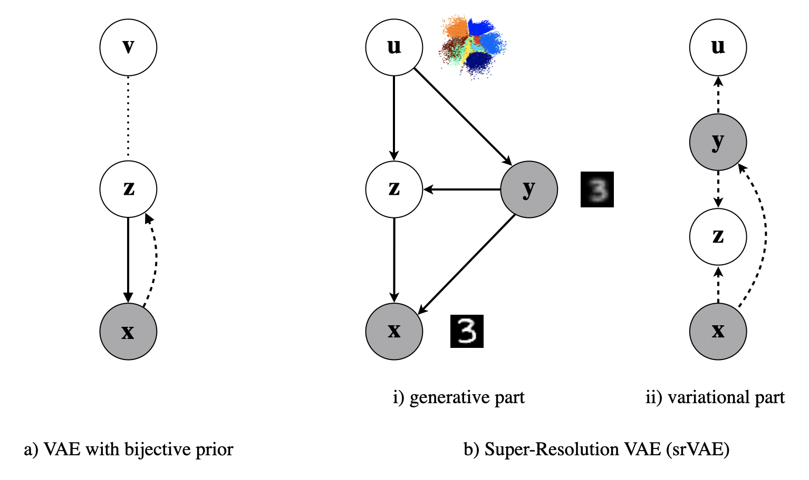
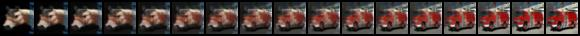
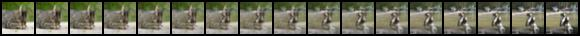
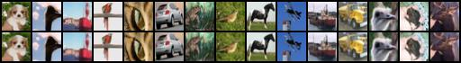
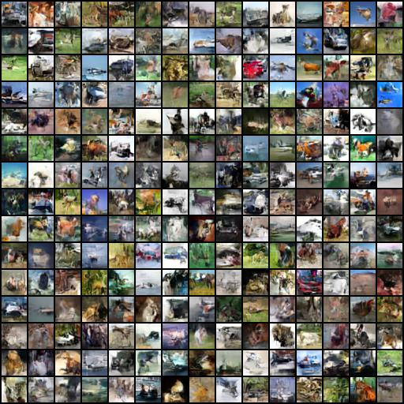
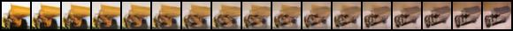
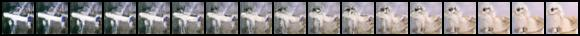
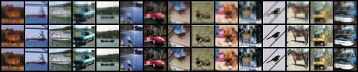
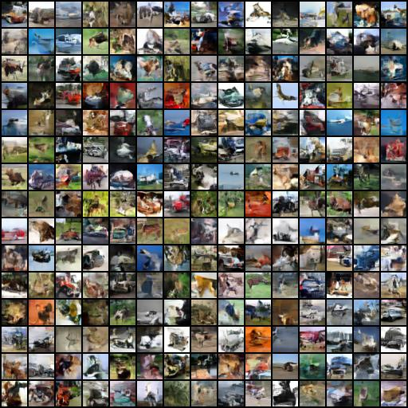

# VAE and Super-Resolution VAE in PyTorch
[](https://www.python.org/) [](https://pytorch.org/docs/1.3.0/) [](LICENSE)

Code release for [Super-Resolution Variational Auto-Encoders](https://arxiv.org/abs/2006.05218)

<p align="center">
  
</p>

### Abstract

<em>The framework of Variational Auto-Encoders (VAEs) provides a principled manner of reasoning in latent-variable models using variational inference.
However, the main drawback of this approach is blurriness of generated images.
Some studies link this effect to the objective function, namely, the (negative) log-likelihood function.
Here, we propose to enhance VAEs by adding a random variable that is a downscaled version of the original image and still use the log-likelihood function as the learning objective.
Further, we provide the downscaled image as an input to the decoder and use it in a manner similar to the super-resolution.
We present empirically that the proposed approach performs comparably to VAEs in terms of the negative log-likelihood function, but it obtains a better FID score.</em>

## Features
- __Models__
    * VAE
    * Super-resolution VAE (srVAE)

- __Priors__
    * Standard (unimodal) Gaussian
    * Mixture of Gaussians
    * RealNVP

- __Reconstruction Loss__
    * Discretized Mixture of Logistics Loss

- __Neural Networks__
    * DenseNet

- __Datasets__
    * CIFAR-10

## Quantitative results

<center>


| **Model**  |   **nll**   |
| :---   |  :---:  |
| VAE    |  3.51   |
| srVAE  |  3.65   |

Results on CIFAR-10. The log-likelihood value *nll* was estimated using 500 weighted samples on the test set (10k images).
</center>


## Qualitative results

### VAE
Results from VAE with RealNVP Prior trained on CIFAR10.

<!-- Interpolations -->
<p align="center">
  
  
</p>
<p align="center">
    Interpolations
</p>

<!-- Reconstructions -->
<p align="center">
  
</p>
<p align="center">
    Reconstructions.
</p>

<!-- Generations -->
<p align="center">
  
</p>
<p align="center">
    Unconditional generations.
</p>


### Super-Resolution VAE

Results from Super-Resolution VAE trained on CIFAR10.

<!-- Interpolations -->
<p align="center">
  
  
</p>
<p align="center">
    Interpolations
</p>

<!-- Super-Resolution -->
<p align="center">
  
</p>
<p align="center">
    Super-Resolution results of the srVAE on CIFAR-10
</p>

<!-- Generations -->
<p align="center">
  
  
</p>

<p align="center">
    Unconditional generations.
    <b>Left:</b> The generations of the first step, the compressed representations that capture the _global_ structure.
    <b>Right:</b> The final result after enhasing the images with local content.
</p>


## Requirements

The code is compatible with:

  * `python 3.6`
  * `pytorch 1.3`

## Usage

 - To run VAE with RealNVP prior on CIFAR-10, please execude:
```
python main.py --model VAE --network densenet32 --prior RealNVP
```

 - Otherwise, to run srVAE:
```
python main.py --model srVAE --network densenet16x32 --prior RealNVP
```

## Cite
Please cite our paper if you use this code in your own work:
```
@misc{gatopoulos2020superresolution,
    title={Super-resolution Variational Auto-Encoders},
    author={Ioannis Gatopoulos and Maarten Stol and Jakub M. Tomczak},
    year={2020},
    eprint={2006.05218},
    archivePrefix={arXiv},
    primaryClass={cs.LG}
}
```

#### *Acknowledgements*
<em>This work was supported and funded from the [University of Amsterdam](https://www.uva.nl/), and [BrainCreators B.V.](https://braincreators.com/)</em>.

#### *Repo Author*
Ioannis Gatopoulos, 2020
